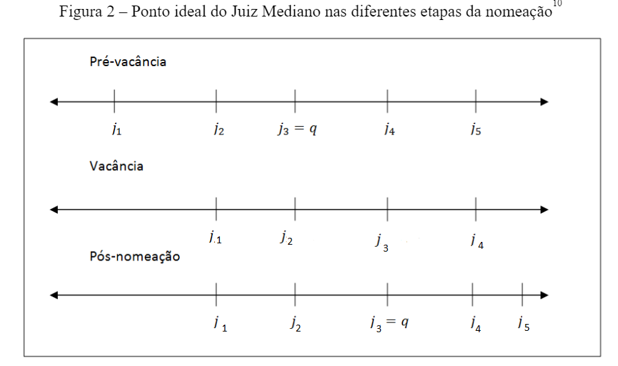
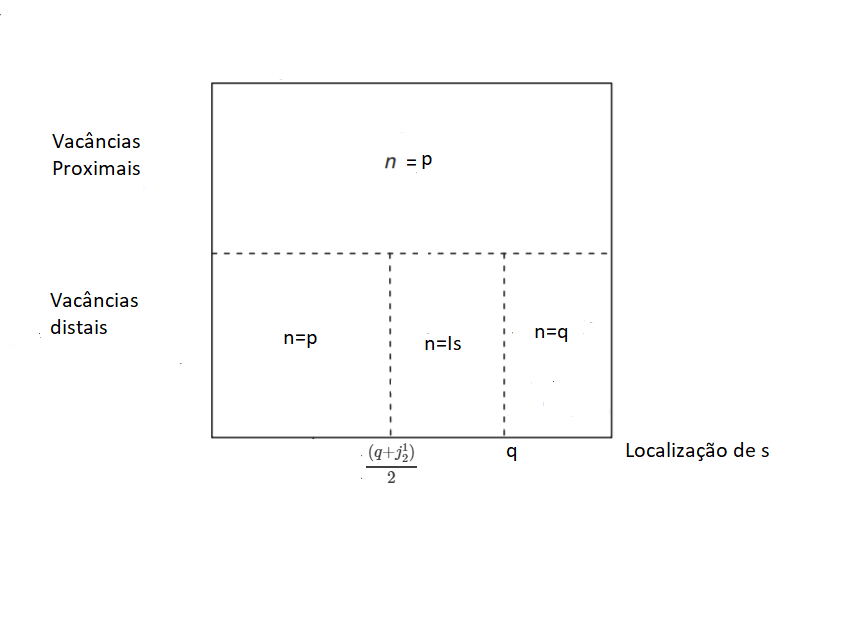

# MTM - Movendo o mediano

## O que é a MTM?

&nbsp;
&nbsp;

A *move-the-median*  - MTM é uma teoria formal que busca explicar o funcionamento do jogo de nomeações para agências reguladoras ou para uma Corte Constitucional - CC

&nbsp;
&nbsp;

A ideia básica da MTM é a de que os jogadores responsáveis pela nomeação realizam suas escolhas sempre com o objetivo de aproximar o Juiz Mediano o máximo possível das suas preferências políticas.

## Atores

&nbsp;
&nbsp;

O jogo da nomeação conta com $2 + n$ atores: 


* O primeiro deles (isto é, o Presidente) é o responsável por escolher o nomeado, também chamado de *agenda settler*;                           


* O segundo jogador (isto é, o Senado) tem a capacidade de vetar ou confirmar a escolha realizada pelo primeiro;                            


* Finalmente, após as primeiras jogadas (confirmando ou rejeitando a nomeação), a CC com $n\geq3$ toma suas decisões através da regra majoritária simples;


## Pressupostos


As teorias de MTM partem, em alguma medida, dos pressupostos abaixo.

<div style="float: left; width: 40%;">


* A vacância do cargo (aposentadoria ou morte) é exógena;

* As decisões da CC são definidas pelo juiz mediano;

* *One-shot-game* 

* *gridlock-averse*

</div>

<div style="float: right; width: 50%;font-size:33px">

* Todos os jogadores possuem informação completa sobre as preferências dos demais

* Todos os jogadores possuem preferências unidimensionais, simétricas e de pico único.

* A CC é composta por 5 membros e com a vacância fica com 4


</div>


## Notação

&nbsp;
&nbsp;

A notação varia de trabalho para trabalho, mas, de maneira geral, segue as padronizações abaixo:

* O ponto ideal do Presidente é $p$, o do Senado $s$ e o do nomeado $n$

* Os juízes da CC possuem pontos ideais: 1) $j_{i}^0$ para a corte pré-vacância; 2) $j_{i}^1$ para a corte durante a vacância; 3) $j_{i}^2$ para a corte pós-nomeação. 

* $q=j_3^0$ é o *status quo*

* $i_s = 2s - q$ é o ponto de indiferença do Senado ($s$) em relação ao *status quo*, isto é, o ponto $i_s$ concende a S o mesmo grau de utilidade que $q$ </p>

## Nomeações equivalentes

&nbsp;
&nbsp;

<div style="float: left; width: 40%;">

O novo juiz mediano sempre estará contido no intervalo dos juízes 2 e 3 da corte durante a vacância ($j_3^2 \in[j^1_2,j^1_3]$)

Além disso, algumas nomeações produzem o mesmo mediano, razão pela qual são equivalentes: $\forall n<j_2^1, j_3^2=j_2^1$ e $\forall n>j_3^1, j_3^2=j_3^1$

</div>

<div style="float: right; width: 50%;">

<center></center>

</div>

## Vacâncias

&nbsp;
&nbsp;

Existem dois tipos de vacâncias, as distais e as proximais

* Vacância distal: ocorre quando o ponto ideal do juiz ($v$) que deixou o cargo e do Presidente estão em lados opostos em relação ao *status quo*, isto é, $v≥q$ e $p<q$.

* Vacância proximal: ocorre quando o ponto ideal do juiz que deixou o cargo e do Presidente estão do mesmo lado em relação ao *status quo*, ou seja, $v>q$ e $p>q$ 

# Equilíbrios

## O que é um equilíbrio?

&nbsp;
&nbsp;

Considerando que uma das principais contribuições desses estudos é identificar os diversos equilíbrios do jogo, vale a pena explicar brevemente o que isso significa. 

O equilíbrio é uma situação em que nenhum dos jogadores consegue unilateralmente aumentar sua utilidade 

```{r include=FALSE}
library(kableExtra)
library(tidyverse)
```


```{r echo=FALSE}

df <-  data.frame(a = c("Ambos são condenados a 6 meses",
                                             "'A' sai livre; 'B' é condenado a 10 anos"),
                  b = c("'A' é condenado a 10 anos; 'B' sai livre",
                                               "Ambos são condenados a 5 anos"))
df <- df %>% mutate(
  b= cell_spec(b, background = ifelse(b=="Ambos são condenados a 5 anos","#eca1a6", "#FFF8DC"))
)

rownames(df) <- c("Prisioneiro 'A' nega	", "Prisioneiro 'A' delata")
colnames(df) <- c("Prisioneiro 'B' nega", "Prisioneiro 'B' delata")


kable(df, escape=FALSE)
```

## Estratégias dos atores

Com o objetivo de maximizar suas utilidades, o Presidente e o Senado adotarão as seguintes estratégias:

* O Presidente escolherá um nomeado que se encontre o mais próximo possível das suas preferências e, ao mesmo tempo, esteja dentro do campo de aceitação por parte do Senado

* O Senado, por sua vez, possui a escolha ($e$) de confirmar ($1$) ou rejeitar ($0$) a nomeação, as quais dependem da localização do antigo mediano $J_3^0$ e do novo $J_3^2$. Em outras palavras:

<p style="border:3px; border-style:dashed; border-color:#FF4136; padding: 1em;font-size:30px;">
$$ e(s,J_3^0,J_3^2) =
  \begin{cases}
    1  & se \quad |s-J_3^2| \leq |s-J_3^0|\\
    0  & se \quad |s-J_3^2| > |s-J_3^0|\\
  \end{cases} $$ </p>

## Equilíbrios

Os equilíbrios do jogo serão diferentes a depender do tipo de vacância (para simplificar, vamos supor que $p<j_2^1$):

<div style="float: left; width: 40%;">

**Vacâncias Proximais**:

Quando a vacância for proximal, o Presidente poderá escolher à vontade o seu nomeado, uma vez que o novo mediano será smpre igual ao antigo. Logo, em nenhuma hipótese o Senado irá rejeitar sua escolha, de modo que $n=p$.

</div>

<div style="float: right; width: 50%;">

**Vacâncias Distais**:

Quando a vacância for distal, o ponto ideal do nomeado será uma função da localização do Presidente, do Senado, do antigo mediano e de $j_2^1$:

<p style="border:3px; border-style:dashed; border-color:#3D9970; padding: 1em;font-size:25px;">
$$ n(p,s,q,j_2^1) =
  \begin{cases}
    q  & se \quad s \geq q\\
    I_s  & se \quad s\in(\frac{(j_2^1+q)}{2}, q)\\
    p  & se \quad s \leq \frac{(j_2^1+q)}{2}\\
  \end{cases} $$
</p>

</div>

## Equilíbrios

&nbsp;
&nbsp;

<center></center>

# Modelos e medição das variáveis

## Modelos

As conclusões da MTM podem ser testadas de diversas formas. 

Em primeiro lugar, podemos testar se, de fato, a localização dos nomeados está de acordo com os equilíbrios encontrados.

Para isso, podemos utilizar o seguinte modelo:

$$ n = \alpha+\beta_1*D_1*p + \beta_2*D_2*I_s + \beta_3*D_3*q+\varepsilon $$
Onde $D_1,D_2 e D_3$ são dummies, $\alpha$ é o intercepto e $\varepsilon$ é um erro normalmente distribuído. 

A hipótese é corroborada se:

* $p,I_s$ e $q$ são indistinguíveis de 1 e distinguíveis de 0


## Modelos

A MTM também pode ser testada verificando-se se as mudanças do mediano da CC ao longo do tempo estão de acordo com a teoria.

$$\Delta M = \alpha + \beta Distal + \gamma Proximal + \varepsilon $$

Onde $\Delta M$ significa a localização do mediano no tempo $t$ menos a localização do mediano em $t-1$. Distal e proximal são variáveis dummies.

Logo, espera-se que $\alpha$ seja indistinguível de 0, isto é, em anos sem nomeações, espera-se que a localização do mediano não seja alterada; 

Espera-se também que $\beta >0$ e $\gamma=0$, ou seja, a localização do mediano somente se altera se a vacância for distal.


## Medição das Variáveis

&nbsp;
&nbsp;

As variáveis de interesse da MTM podem ser medidas de diversas formas:

* Ponto ideal do nomeado: Segal-Cover score

* Ponto ideal do *status quo* e demais juízes da CC: média simples de votação em casos sobre liberdade civil ou alguma técnica para estimação de ponto ideal (W-nominate ou MCMC)

* Ponto ideal do Presidente e do Senado: *Americans for democratic action* - ADA score ou w-nominate

# Referências

## 

&nbsp;
&nbsp;

<p style="margin-left: 2em; text-indent: -3em "> CAMERON, C.; KASTELLEC, J.. *Are Supreme Court Nominations a Move-the-Median Game?* American Political Science Review, 110(4), 778-797, 2016. </p>

<p style="margin-left: 2em; text-indent: -3em "> KREHBIEL, KEITH. *Supreme Court Appointments as a Move-the-Median Game*. American Journal of Political Science, 51, 2007. </p>

<p style="margin-left: 2em; text-indent: -3em "> LAX, Jeffrey; CAMERON, Charles. *Bargaining and Opinion Assignment on the U.S. Supreme Court*. New York University Public Law and Legal Theory Working Papers, 23, 2006. </p>

<p style="margin-left: 2em; text-indent: -3em "> MORASKI, Byron J.; SHIPAN, Charles R.. *The Politics of Supreme Court Nominations: A Theory of Institutional Constraints and Choices*. American Journal of Political Science 43(4):1069–95, 1999. </p>

<p style="margin-left: 2em; text-indent: -3em "> ROHDE, David W.; SHEPSLE, Kenneth A.. *Advising and Consenting in the 60-Vote Senate: Strategic Appointments to the Supreme Court.* Journal of Politics 69 (3): 664–77, 2007. </p>


 